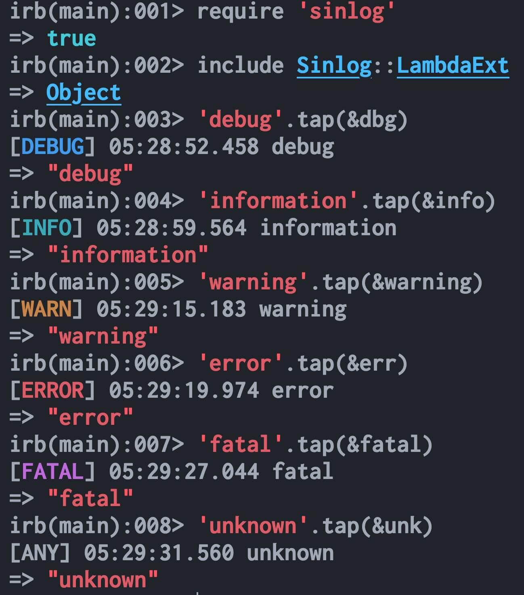
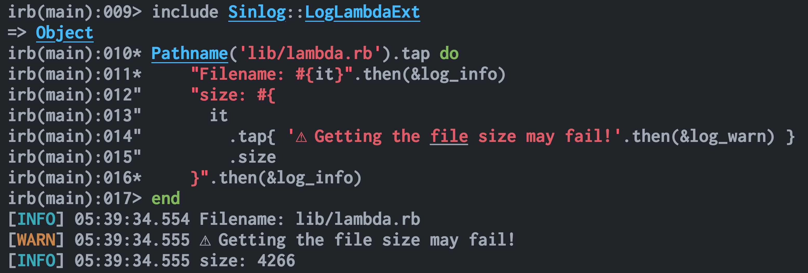

# Sinlog

一個非常非常簡單的 ruby 單例日誌記錄器，其中日誌級別帶有彩色高亮。

> 單例（Singleton）意味著整個程式會共享同一個例項（日誌記錄器）。

[](https://rubygems.org/gems/sinlog)   [](https://www.rubydoc.info/gems/sinlog)

---

| Language/語言              | ID         |
| -------------------------- | ---------- |
| 繁體中文                   | zh-Hant-TW |
| [English](./Readme.md)     | en-Latn-US |
| [简体中文](./Readme-zh.md) | zh-Hans-CN |

---

<details>
<summary>
目錄（點選展開）
</summary>

- [Learn Sinlog API By Example](#learn-sinlog-api-by-example)
  - [include module](#include-module)
    - [LambdaExt](#lambdaext)
    - [LogLambdaExt](#loglambdaext)
  - [Classic Method Call](#classic-method-call)
- [進階](#進階)
  - [Real World Example](#real-world-example)
  - [日誌級別](#日誌級別)
  - [環境變數](#環境變數)
  - [日誌輸出裝置/路徑](#日誌輸出裝置路徑)
  - [其他 logger 方法](#其他-logger-方法)
  - [注意事項](#注意事項)
- [題外話](#題外話)
- [License](#license)

</details>

## Learn Sinlog API By Example

首先，安裝 sinlog。

```sh
gem install sinlog
```

然後，我們可以執行 `irb` 來快速體驗一番。

### include module

#### LambdaExt

當出現： `irb(main):001>` 後，我們就能開始操作了。

```ruby
irb(main):001> require 'sinlog'

irb(main):002> include Sinlog::LambdaExt
# 它提供了: dbg, info, warning, err, fatal, unk
# 我們可以用 .tap(&dbg) 或 .then(&dbg) 來呼叫。

irb(main):003> 'debug'.tap(&dbg)
irb(main):004> 'information'.tap(&info)

# 注：建立 warn 方法，會導致 irb 的補全功能出問題。
#   因此 LambdaExt 用的是 warning, 而不是 warn。
#   您如果確實需要 warn，那就呼叫 include Sinlog::LambdaWarnExt
irb(main):005> 'warning'.tap(&warning)

irb(main):006> 'error'.tap(&err)
irb(main):007> 'fatal'.tap(&fatal)
irb(main):008> 'unknown'.tap(&unk)
```



LambdaExt 提供了:

- dbg
- info
- warning
- wng (與 warning 相同，只是名稱不同)
- err
- fatal
- unk

#### LogLambdaExt

有一個與 LambdaExt 特別相似的模組，名為 LogLambdaExt。  
它們之間最主要的區別在於 lambda 函式的名稱。

- LogLambdaExt 帶有 `log_` 字首
- LambdaExt 沒有

LambdaExt 與 LogLambdaExt 可以同時 include, 不過在一般情況下，我們引入其中一個就夠用了。

至於哪一個更好呢？

我們不妨親自上手試試，瞭解其中的區別，最後挑一個自己喜歡的。

```ruby
irb(main):009> include Sinlog::LogLambdaExt
# 它提供了 log_dbg, log_info, log_warn, log_err, log_fatal, log_unk
# 我們可以用 .tap(&log_dbg) 或 .then(&log_dbg) 來呼叫。

irb(main):010> "debug".tap(&log_dbg)
irb(main):011> "information".tap(&log_info)

# 注：這裡用的是 log_warn，而不是 log_warning
irb(main):012> "warning".tap(&log_warn)

irb(main):013> "error".tap(&log_err)
irb(main):014> "fatal".tap(&log_fatal)
irb(main):015> "unknown".tap(&log_unk)
```

```ruby
# 這是一個更復雜的例子
irb(main):016> require 'pathname'

irb(main):017> Pathname('lib/lambda.rb').tap do
    "Filename: #{it}".then(&log_info)
    "size: #{
      it
        .tap{ '⚠️ 獲取檔案大小可能會失敗'.then(&log_warn) }
        .size
    }".then(&log_info)
end
```



LogLambdaExt 提供了:

- log_dbg
- log_info
- log_warn
- log_warning (與 log_warn 相同，只是名稱不同)
- log_wng (與 log_warn 相同，只是名稱不同)
- log_err
- log_fatal
- log_unk

### Classic Method Call

您如果不喜歡 lambda，那就試試經典的方法呼叫吧！

先執行 irb 進入 ruby repl，接著一步一步執行。

```ruby
irb(main):001> require 'sinlog'

irb(main):002> log = Sinlog.instance.logger

irb(main):003> log.debug 'debug'
irb(main):004> log.info 'information'
irb(main):005> log.warn 'warning'
irb(main):006> log.error 'error'
irb(main):007> log.fatal 'fatal'
irb(main):008> log.unknown 'unknown'
```

Sinlog.instance.logger 提供了 ruby 標準庫的 logger 的方法。

最常見的有：

- debug
- info
- warn
- error
- fatal
- unknown

## 進階

在親自上手嘗試之後，我們已經對 sinlog 有了初步的瞭解。  
在一般情況下，瞭解其基本用法就已經足夠了。

您如果對此感興趣的話，不妨與我一同繼續探索。

### Real World Example

在現實世界中，我們的程式可能會是這樣子的：

```ruby
require 'sinlog'

class EpubProcessor
  def initialize(epub_file, logger = nil)
    @epub = epub_file
    @logger = logger || Sinlog.instance.tap { it.fetch_env_and_update_log_level("XX_LOG") }.logger
    @logger.debug "EpubProcessor class 初始化完成。"

  end
end
```

我們可能會定義類的 @logger 例項變數，並允許自定義 logger。

簡單來說，我們可能會對 logger 進行更精細化的配置。

在接下來的內容中，我們將探討如何進行“更精細化的配置”。

### 日誌級別

日誌級別從低到高，依次是：

- debug = 0
- info = 1
- warn = 2
- error = 3
- fatal = 4
- unknown = 5

```ruby
p Sinlog::LV
# => {debug: 0, info: 1, warn: 2, error: 3, fatal: 4, unknown: 5}

# 將日誌級別修改為 warn
log = Sinlog.instance.logger.tap {it.level = Sinlog::LV[:warn]}
# 或者是：
# log = Sinlog.instance.logger.tap {it.level = 2}

log.error "這條訊息會顯示出來！低級別 WARN（2）會顯示高級別 ERROR(3) 的日誌。"
log.info "這條訊息不會顯示出來！高級別 WARN(2) 不會顯示低級別 INFO(1) 的日誌。"
```

- 日誌級別越低，顯示的內容越詳細。
- 低級別 **會** 顯示高級別的日誌。
- 高級別 **不會** 顯示低級別的日誌。

### 環境變數

在現實世界中，對於客戶端應用，最後執行程式的是普通使用者。  
為了能讓普通使用者直接配置 log.level，我們可以透過環境變數來配置。

> 使用環境變數足夠簡單也足夠高效。

Sinlog 在預設情況下，會嘗試讀取環境變數 RUBY_LOG 的值。

本質上呼叫了 `fetch_env_and_update_log_level(env_name = 'RUBY_LOG')` 函式。

- 若該環境變數不存在，則使用 debug(0)。
- 若該環境變數存在，且其值為空，則使用 unknown(5)。
- 若該環境變數的值無效，則使用 unknown(5)。

我們可以用 POSIX-sh 設定環境變數，然後 logger 在初始化的時候，就會自動將日誌級別設定為（RUBY_LOG的值）warn。

```sh
# 可選值：debug, info, warn, error, fatal
export RUBY_LOG=warn
```

您如果不想要預設的 RUBY_LOG 環境變數，而是想要 XX_CLI_LOG 的值，那可以這樣子做：

POSIX-sh:

```sh
export XX_CLI_LOG=info
```

ruby:

```ruby
logger = Sinlog.instance.tap { it.fetch_env_and_update_log_level("XX_CLI_LOG") }.logger

logger.debug "由於當前日誌級別為 INFO(1)，因此不會顯示此訊息 DEBUG(0)。"
logger.info "Hello!"
```

### 日誌輸出裝置/路徑

預設情況下，Sinlog 會輸出到 STDERR。

您如果需要自定義日誌輸出路徑的話，那可以呼叫 logger 的 reopen 方法。

```ruby
# 日誌會輸出到 a.log 檔案
log = Sinlog.instance.logger.tap {it.reopen("a.log")}

log.error "發生甚麼事了！QuQ"
```

OR:

```ruby
log = Sinlog.instance.logger
log.reopen("a.log")

log.error "發生甚麼事了！QuQ"
```

### 其他 logger 方法

除了 `.reopen`, `.level` 外，我們還可以在 `Sinlog.instance.logger` 上呼叫 ruby 標準庫的 logger 的其他方法。

### 注意事項

Sinlog 用的是 Singleton 單例模式，整個程式會共享同一個例項（日誌記錄器）。

在同一個程式的 class A 中修改 Sinlog 後，會影響到 class B 的 Sinlog。

## 題外話

這是我釋出的第一個 ruby gem。  
其中的 api 不一定符合地道的 ruby 用法，還請大家多多諒解。

## License

[MIT License](../License)
