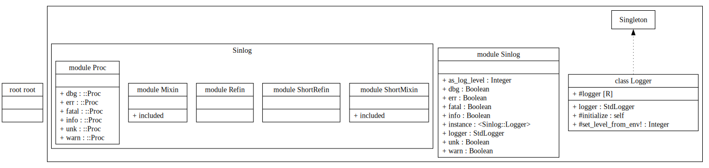

# Sinlog

一个非常非常简单的 ruby 单例日志记录器，其中日志级别带有彩色高亮。

> 单例（Singleton）意味着整个程序会共享同一个实例（日志记录器）。

[](https://rubygems.org/gems/sinlog)
<!-- [](https://www.rubydoc.info/gems/sinlog) -->

---

| Language/語言                   | ID         |
| ------------------------------- | ---------- |
| 简体中文                        | zh-Hans-CN |
| [English](./Readme.md)          | en-Latn-US |
| [繁體中文](./Readme-zh-Hant.md) | zh-Hant-TW |

---

<details>
<summary>
目录（点击展开）
</summary>

- [API DOC](#api-doc)
- [快速上手](#快速上手)
  - [安装](#安装)
  - [API style](#api-style)
    - [Procedural Style](#procedural-style)
    - [OOP style](#oop-style)
    - [FP Style](#fp-style)
- [Monkey Patching](#monkey-patching)
  - [对照表](#对照表)
  - [方法列表](#方法列表)
    - [Mixin \& Refin](#mixin--refin)
    - [ShortMixin \& ShortRefin](#shortmixin--shortrefin)
  - [例子](#例子)
    - [Refinement](#refinement)
    - [Mixin](#mixin)
- [Learn Sinlog API By Example](#learn-sinlog-api-by-example)
- [进阶](#进阶)
  - [Real World Example](#real-world-example)
  - [日志级别](#日志级别)
  - [环境变量](#环境变量)
  - [日志输出设备/路径](#日志输出设备路径)
  - [其他 logger 方法](#其他-logger-方法)
  - [注意事项](#注意事项)
- [题外话](#题外话)
- [License](#license)

</details>

## API DOC



- Github Pages: <https://2moe.github.io/sinlog-gem>

## 快速上手

### 安装

```sh
# POSIX-sh
#
gem install sinlog
```

### API style

在此库中，一套相似的功能，有多种不同的调用方式。

选择哪种风格，主要取决于您的偏好。

#### Procedural Style

```ruby
require 'sinlog'

# update the Sinlog logger level
Sinlog.logger(level: "debug")
  # OR: Sinlog::Logger.logger("debug")

Sinlog.dbg 'debug'
Sinlog.info 'information'
Sinlog.warn 'warning'
Sinlog.err 'error'
Sinlog.fatal 'fatal'
Sinlog.unk 'unknown'
```

OR：

```sh
# POSIX-sh

# 设置环境变量，YOUR_CUSTOM_LOG 可以改为其他的名称
export YOUR_CUSTOM_LOG=debug
```

```ruby
# RUBY

require 'sinlog'

log = Sinlog.logger(env_name: "YOUR_CUSTOM_LOG")
log.debug "This is a debug message"
log.info 'information'
log.warn 'warning'
log.error 'error'
log.fatal 'fatal'
log.unknown 'unknown'
```

#### OOP style

```ruby
require 'sinlog'

using Sinlog::Refin
# OR: include Sinlog::Mixin

'debug'.log_dbg
'information'.log_info
'warning'.log_warn
'error'.log_err
'fatal'.log_fatal
'unknown'.log_unk
```

#### FP Style

```ruby
require 'sinlog'

# update the Sinlog logger level
{level: "dbg"}.then { Sinlog.logger **_1 }

Log = Sinlog::Proc

'debug'.tap &Log.dbg
  # OR: Log.dbg['debug']
  # OR: Log.dbg.call 'debug'
  # OR: Log.dbg.('debug')

class Object; def ▷(f) = f.call(self) end

true.▷(Log.dbg >> Log.info >> Log.warn >> Log.err >> Log.fatal >> Log.unk)
```


## Monkey Patching

### 对照表

| 模块       | Type       | Activation | 方法                                                     |
| ---------- | ---------- | ---------- | -------------------------------------------------------- |
| Mixin      | Mixin      | include    | log_dbg, log_info, log_warn, log_err, log_fatal, log_unk |
| Refin      | Refinement | using      | log_dbg, log_info, log_warn, log_err, log_fatal, log_unk |
| ShortMixin | Mixin      | include    | dbg, info, warn, err, fatal, unk                         |
| ShortRefin | Refinement | using      | dbg, info, warn, err, fatal, unk                         |

### 方法列表

#### Mixin & Refin

- `log_dbg`   – DEBUG
- `log_info`  – INFO
- `log_warn`  – WARN
- `log_err`   – ERROR
- `log_fatal` – FATAL
- `log_unk`   – UNKNOWN

#### ShortMixin & ShortRefin

- ShortRefin 类似于 Refin
  - 除了方法的命名不同外，二者的内部实现没有任何区别。
    - Refin 的方法带有 `log_` 前缀
    - ShortRefin 没有

- ShortMixin 类似于 Mixin
  - 二者的区别只是命名不同
    - Mixin 的方法带有 `log_` 前缀
    - ShortMixin 没有

---

- `dbg`   – DEBUG
- `info`  – INFO
- `warn`  – WARN
- `err`   – ERROR
- `fatal` – FATAL
- `unk`   – UNKNOWN

> ⚠️ 由于 ShortMixin & ShortRefin 带有 warn 方法，因此会覆盖 warn。
> 对于 ruby 代码中的 `warn "msg"` (输出到 stderr 而非输出为日志格式)，您可能需要手动将其修改为 `Kernel.warn "msg"`。
>
> 如果介意的话，那就使用 `using Sinlog::Refin` 而不是 `using Sinlog::ShortRefin`。

### 例子

#### Refinement

```ruby
require 'sinlog'
using Sinlog::Refin
{ dir: "/path/to/xx" }.log_info
```

```ruby
require 'sinlog'
using Sinlog::ShortRefin
{ dir: "/path/to/xx" }.info
```

#### Mixin

```ruby
require 'sinlog'
include Sinlog::Mixin
"Hello".log_info
```

```ruby
require 'sinlog'
include Sinlog::ShortMixin
"Hello".info
```

## Learn Sinlog API By Example


```ruby
require 'sinlog'

module A
  module_function
  using Sinlog::ShortRefin

  def log
    ['喂喂喂123，能看到这条调试消息吗？',
    '您可能会觉得我有点啰嗦，哈哈哈！'].dbg
    '神经，害我笑了一下。'.info

    '开门！查水表。'.warn
    { error: "IO", type: "输入数据无效" }.err
    '不行啦！出错了，继续运行下去会坏掉的。'.err
    '滋滋滋，已经坏..掉...了..了~'.fatal
  end
end


A.log

# 修改日志级别为 error
Sinlog.logger(level: 'err')
Kernel.warn 'Logger.level => error'
A.log
```

## 进阶

在亲自上手尝试之后，我们已经对 sinlog 有了初步的了解。
在一般情况下，了解其基本用法就已经足够了。

您如果对此感兴趣的话，不妨与我一同继续探索。

### Real World Example

在现实世界中，我们的程序可能会是这样子的：

```ruby
require 'sinlog'

class EpubProcessor
  def initialize(epub_file, logger = nil)
    @epub = epub_file
    logger ||= Sinlog::logger(env_name: "XX_LOG")
    @logger = logger
    @logger.debug "EpubProcessor class 初始化完成。"
  end
end
```

我们可能会定义类的 @logger 实例变量，并允许自定义 logger。

简单来说，我们可能会对 logger 进行更精细化的配置。

在接下来的内容中，我们将探讨如何进行“更精细化的配置”。

### 日志级别

日志级别从低到高，依次是：

- debug = 0
- info = 1
- warn = 2
- error = 3
- fatal = 4
- unknown = 5

> 有意思的一点是： ruby 的标准库的 logger 的日志级别与 rust 的 [log::Level](https://docs.rs/log/latest/log/enum.Level.html) 是相反的。

```ruby
p Sinlog::LV
# => {debug: 0, info: 1, warn: 2, error: 3, fatal: 4, unknown: 5}

# 将日志级别修改为 warn
log = Sinlog.logger(level: 'warn')
# OR:
#   log = Sinlog.logger(level: Sinlog::LV[:warn])
# OR:
#   log = Sinlog.logger.tap { it.level = 2 }

log.error "这条消息会显示出来！低级别 WARN（2）会显示高级别 ERROR(3) 的日志。"
log.info "这条消息不会显示出来！高级别 WARN(2) 不会显示低级别 INFO(1) 的日志。"
```

- 日志级别越低，显示的内容越详细。
- 低级别 **会** 显示高级别的日志。
- 高级别 **不会** 显示低级别的日志。

### 环境变量

在现实世界中，对于客户端应用，最后运行程序的是普通用户。
为了能让普通用户直接配置 log.level，我们可以通过环境变量来配置。

> 使用环境变量足够简单也足够高效。

`Sinlog::Logger` 在初始化时，会尝试读取环境变量 `RUBY_LOG` 的值。

- 若该环境变量不存在，则使用 debug(0)。
- 若该环境变量存在，且其值为空，则使用 error(3)。
- 若该环境变量的值无效，则使用 error(3)。

我们可以用 POSIX-sh 设置环境变量，然后 logger 在初始化的时候，就会自动将日志级别设置为（RUBY_LOG的值）warn。

```sh
# 可选值：debug, info, warn, error, fatal
export RUBY_LOG=warn
```

您如果不想要默认的 RUBY_LOG 环境变量，而是想要 XX_CLI_LOG 的值，那可以这样子做：

POSIX-sh:

```sh
export XX_CLI_LOG=info
```

ruby:

```ruby
logger = Sinlog.logger(env_name:"XX_CLI_LOG")

logger.debug "由于当前日志级别为 INFO(1)，因此不会显示此消息 DEBUG(0)。"
logger.info "Hello!"
```

### 日志输出设备/路径

默认情况下，Sinlog 会输出到 `STDERR`。

> `Sinlog.logger` 的数据类型为 ruby 标准库的 Logger。

您如果需要自定义日志输出路径的话，那可以调用 logger 的 reopen 方法。

```ruby
# 日志会输出到 a.log 文件
log = Sinlog.logger.tap {it.reopen("a.log")}

log.error "发生甚么事了！QuQ"
```

OR:

```ruby
log = Sinlog.logger
log.reopen("a.log")

log.error "发生甚么事了！QuQ"
```

### 其他 logger 方法

除了 `.reopen`, `.level` 外，我们还可以在 `Sinlog.logger` 上调用 ruby 标准库的 logger 的其他方法。

详见 <https://docs.ruby-lang.org.cn/en/3.4/Logger.html>

### 注意事项

`Sinlog::Logger` 用的是 Singleton 单例模式，整个程序会共享同一个实例（日志记录器）。

在同一个程序的 class A 中修改 `Sinlog.logger` (a.k.a. `Sinlog::Logger.instance.logger`) 后，会影响到 class B 的 `Sinlog::Logger`。

## 题外话

这是我发布的第一个 ruby gem。
其中的 api 不一定符合地道的 ruby 用法，还请大家多多谅解。

## License

[MIT License](../License)
