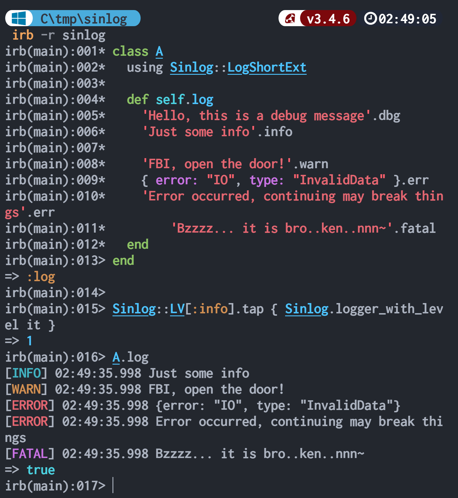

# Sinlog

A very, very simple Ruby singleton logger with colored log levels.

> Singleton means that the entire program will share the same instance (logger).

[](https://rubygems.org/gems/sinlog)
<!-- [](https://www.rubydoc.info/gems/sinlog) -->

---

| Language/語言                   | ID         |
| ------------------------------- | ---------- |
| English                         | en-Latn-US |
| [简体中文](./Readme-zh.md)      | zh-Hans-CN |
| [繁體中文](./Readme-zh-Hant.md) | zh-Hant-TW |

---

<details>
<summary>
Table of Contents (click to expand)
</summary>

- [Quick Start](#quick-start)
- [Installation](#installation)
  - [Comparison](#comparison)
  - [Method List](#method-list)
    - [Loggable \& LogExt](#loggable--logext)
    - [LogShortExt](#logshortext)
  - [Examples](#examples)
    - [Classic Method Call (Neither Mixin nor Refinement)](#classic-method-call-neither-mixin-nor-refinement)
    - [Mixin](#mixin)
    - [Refinement](#refinement)
- [Learn Sinlog API by Example](#learn-sinlog-api-by-example)
  - [Classic Method Call](#classic-method-call)
- [Advanced](#advanced)
  - [Real World Example](#real-world-example)
  - [Log Levels](#log-levels)
  - [Environment Variables](#environment-variables)
  - [Log Output Device/Path](#log-output-devicepath)
  - [Other Logger Methods](#other-logger-methods)
  - [Notes](#notes)
- [Side Note](#side-note)
- [Changelog](#changelog)
  - [0.0.3](#003)
- [License](#license)

</details>

## Quick Start

## Installation

```sh
# POSIX-sh
#
gem install sinlog
```

### Comparison

| Module      | Type       | Methods                                      |
| ----------- | ---------- | -------------------------------------------- |
| Loggable    | Mixin      | `log_dbg`, `log_info`, etc.                  |
| LogExt      | Refinement | `log_dbg`, `log_info`, etc.                  |
| LogShortExt | Refinement | `dbg`, `info`, `warn`, `err`, `fatal`, `unk` |

### Method List

#### Loggable & LogExt

*   `log_dbg`   – DEBUG
*   `log_info`  – INFO
*   `log_warn`  – WARN
*   `log_err`   – ERROR
*   `log_fatal` – FATAL
*   `log_unk`   – UNKNOWN

#### LogShortExt

`LogShortExt` works the same way as `LogExt`, except for method naming:

  - `LogExt` methods use the `log_` prefix.
  - `LogShortExt` methods do not.

---

- `dbg`   – DEBUG
- `info`  – INFO
- `warn`  – WARN
- `err`   – ERROR
- `fatal` – FATAL
- `unk`   – UNKNOWN

> ⚠️ Note: `LogShortExt` defines a `warn` method, which overrides Ruby’s built-in `warn`.
> If you need to call the original `warn "msg"`, use `Kernel.warn "msg"` instead.
>
> If this is a concern, use `using Sinlog::LogExt` instead of `using Sinlog::LogShortExt`.

### Examples

#### Classic Method Call (Neither Mixin nor Refinement)

```ruby
require 'sinlog'

log = Sinlog.logger
log.info "Information"
log.debug "This is a debug message"
```

#### Mixin

```ruby
require 'sinlog'
include Sinlog::Loggable
"Hello".log_info
```

#### Refinement

```ruby
require 'sinlog'
using Sinlog::LogExt
{ dir: "/path/to/xx" }.log_info
```

## Learn Sinlog API by Example



```ruby
require 'sinlog'

class A
  using Sinlog::LogShortExt

  def self.log
    'Hello, this is a debug message.'.dbg
    'Just some info.'.info

    'FBI, open the door!'.warn
    { error: "IO", type: "InvalidData" }.err
    'Error occurred, continuing may break things.'.err
    'Bzzzz... it is bro...ken...nnn~'.fatal
  end
end

Sinlog::LV[:info].then do
  Sinlog.logger_with_level it
end

A.log
```

### Classic Method Call

If you prefer the traditional style (`log.info(msg)` instead of `msg.info`):

```ruby
require 'sinlog'

log = Sinlog.logger

log.debug 'debug'
log.info 'information'
log.warn 'warning'
log.error 'error'
log.fatal 'fatal'
log.unknown 'unknown'
```

> The data type of `Sinlog.logger` is Ruby’s standard library `Logger`.

In addition to the common methods listed above, you can also use other methods such as `.reopen`.
For details, see <https://docs.ruby-lang.org/en/3.4/Logger.html>

  - `debug`
  - `info`
  - `warn`
  - `error`
  - `fatal`
  - `unknown`

## Advanced

After trying it out ourselves, we have a basic understanding of `sinlog`.
In most cases, knowing its basic usage is sufficient.

If you're interested, let's continue exploring together.

### Real World Example

In the real world, our program might look like this:

```ruby
require 'sinlog'

class EpubProcessor
  def initialize(epub_file, logger = nil)
    @epub = epub_file
    @logger = logger || Sinlog.instance.tap { it.set_level_from_env!("XX_LOG") }.logger
    @logger.debug "EpubProcessor class initialization completed."
  end
end
```

We might define a class's `@logger` instance variable and allow for a custom logger.

Simply put, we might configure the logger more finely.

In the following content, we will explore how to perform "more fine-grained configuration."

### Log Levels

Log levels from low to high are:

- debug = 0
- info = 1
- warn = 2
- error = 3
- fatal = 4
- unknown = 5

```ruby
p Sinlog::LV
# => {debug: 0, info: 1, warn: 2, error: 3, fatal: 4, unknown: 5}

# Change the log level to warn
log = Sinlog.logger_with_level(Sinlog::LV[:warn])
# OR:
#   log = Sinlog.logger.tap { it.level = Sinlog::LV[:warn] }
# OR:
#   log = Sinlog.instance.logger.tap { it.level = 2 }

log.error "This message will be displayed! Lower level WARN (2) will display higher level ERROR (3) logs."
log.info "This message will not be displayed! Higher level WARN (2) will not display lower level INFO (1) logs."
```

- The lower the log level, the more detailed the content displayed.
- Lower levels **will** display higher level logs.
- Higher levels **will not** display lower level logs.

### Environment Variables

In the real world, for client applications, the end users are typically regular users.
To allow them to configure `log.level` directly, we can use environment variables.

> Using environment variables is simple and efficient.

By default, Sinlog will attempt to read the value of the environment variable `RUBY_LOG`.

It essentially calls the function `set_level_from_env!(env_name = 'RUBY_LOG')`.

- If the environment variable does not exist, it uses `debug(0)`.
- If the environment variable exists but is empty, it uses `unknown(5)`.
- If the environment variable's value is invalid, it uses `unknown(5)`.

We can set the environment variable using POSIX-sh, and then the logger will automatically set the log level to `warn` (the value of `RUBY_LOG`) during initialization.

```sh
# Possible values: debug, info, warn, error, fatal
export RUBY_LOG=warn
```

If you don't want to use the default `RUBY_LOG` environment variable and prefer to use the value of `XX_CLI_LOG`, you can do it like this:

POSIX-sh:

```sh
export XX_CLI_LOG=info
```

Ruby:

```ruby
logger = Sinlog.instance.tap { it.set_level_from_env!("XX_CLI_LOG") }.logger

logger.debug "This message will not be displayed because the current log level is INFO(1)."
logger.info "Hello!"
```

### Log Output Device/Path

By default, Sinlog outputs to `STDERR`.

If you need to customize the log output path, you can call the Logger's `reopen` method.

```ruby
# Logs will be output to the file a.log
log = Sinlog.logger.tap { it.reopen("a.log") }

log.error "What happened! QuQ"
```

OR:

```ruby
log = Sinlog.logger
log.reopen("a.log")

log.error "What happened! QuQ"
```

### Other Logger Methods

In addition to `.reopen` and `.level`, we can also call other methods from Ruby's standard library logger on `Sinlog.instance.logger`.

### Notes

Sinlog uses the Singleton pattern, meaning the entire program will share the same instance (logger).

Modifying Sinlog in class A of the same program will affect Sinlog in class B.

## Side Note

This is the first Ruby gem I have released.
The API might not fully adhere to idiomatic Ruby usage, so I appreciate your understanding.

## Changelog

### 0.0.3

- `Sinlog.instance.logger` can be simplified => `Sinlog.logger`

- add `Sinlog.logger_with_level`
  - e.g., `logger = Sinlog.logger_with_level(Sinlog::LV[:warn])`
  - old: `Sinlog.instance.logger.tap { it.level = Sinlog::LV[:warn] }`

- add `LogExt`, `LogShortExt` and `Loggleable`

- add sorbet **.rbi** files

Breaking changes:
- `fetch_env_and_update_log_level(ENV_NAME)` => `set_level_from_env!(ENV_NAME)`
- remove `LogLambdaExt` and related modules

## License

[MIT License](../License)
